# Evaluacion 2 Desarrollo de software web 1

## Encargo: Gestion de Proyectos

Aplicacion desarrollada en Laravel para la gestion de proyectos. Esta version corresponde a la Evaluacion 2 e incorpora autenticacion de usuarios, registro con contrasena cifrada, proteccion de rutas y asociacion de proyectos al usuario que los crea.

### Entrega:

- Integrantes
    - Pia Alarcón
    - Ain Cortés
- Sección: 50
- Docente: Victor Cofre

## Tecnologias utilizadas

- Laravel 11
- PHP 8.3
- Bootstrap 5
- MySQL

## Funcionalidades principales

- registro de usuarios
- inicio y cierre de sesion
- proteccion de rutas con middleware `auth`
- listado de proyectos
- vista para crear proyectos
- vista para ver un proyecto por ID
- vista para editar proyectos
- vista de confirmacion para eliminar proyectos
- asociacion de cada proyecto con su usuario creador
- componente reutilizable que muestra un valor UF simulado

## Modelos principales

### User

- `id`
- `name`
- `email`
- `password`

### Proyecto

- `id`
- `nombre`
- `fecha_inicio`
- `estado`
- `responsable`
- `monto`
- `created_by`

## Instalacion y ejecucion

1. Instalar dependencias de PHP:

```bash
composer install
```

2. Instalar dependencias de frontend:

```bash
npm install
```

3. Crear el archivo de entorno si aun no existe:

```bash
cp .env.example .env
```

4. Configurar MySQL en `.env`:

```env
DB_CONNECTION=mysql
DB_HOST=127.0.0.1
DB_PORT=3306
DB_DATABASE=desarrollo_software_1
DB_USERNAME=root
DB_PASSWORD=desarrollo_software_1
```

5. Crear la base de datos en MySQL:

```sql
CREATE DATABASE desarrollo_software_1;
```

6. Generar la clave de la aplicacion:

```bash
php artisan key:generate
```

7. Ejecutar migraciones y seeders:

```bash
php artisan migrate:fresh --seed
```

8. Levantar el servidor:

```bash
php artisan serve
```

9. En otra terminal, ejecutar Vite si se desea trabajar con assets en desarrollo:

```bash
npm run dev
```

## Credenciales de prueba

Si ejecutas los seeders, queda disponible este usuario:

- email: `test@example.com`
- password: `desarrollo_software_1`

## Flujo de autenticacion

1. Un usuario puede registrarse en `/register`
2. El registro crea el usuario con contrasena cifrada
3. Luego inicia sesion automaticamente
4. Todas las rutas de proyectos requieren autenticacion
5. Cada proyecto nuevo se guarda con `created_by` igual al ID del usuario autenticado

## Prueba manual sugerida

1. Entrar a `/`
2. Verificar redireccion a `login`
3. Registrar un usuario nuevo o usar el usuario de prueba
4. Confirmar acceso al listado de proyectos
5. Crear un proyecto nuevo
6. Verificar que aparece el nombre del creador en el listado
7. Editar el proyecto
8. Eliminar el proyecto
9. Cerrar sesion
10. Intentar volver a `/proyectos` y comprobar redireccion a `login`

## Rutas principales

- `/`
- `/login`
- `/register`
- `/logout`
- `/proyectos`
- `/proyectos/crear`
- `/proyectos/{id}`
- `/proyectos/{id}/editar`
- `/proyectos/{id}/eliminar`

## Base de datos

El proyecto utiliza MySQL con la base `desarrollo_software_1`. La relacion entre proyectos y usuarios se implementa mediante el campo `created_by`, que referencia `users.id`.

## Migraciones y seeders

- migracion base de `users`
- migracion base de `proyectos`
- migracion adicional para agregar `created_by` a `proyectos`
- `DatabaseSeeder` crea un usuario de prueba conocido
- `ProyectoSeeder` crea un proyecto asociado a ese usuario

## Componente UF

La vista principal de proyectos incorpora el componente reutilizable `x-uf-extract`, que muestra:

- nombre del servicio
- valor UF simulado
- fecha del dia
- mensaje de servicio externo simulado

## Capturas de pantalla Vistas solicitadas

### Login

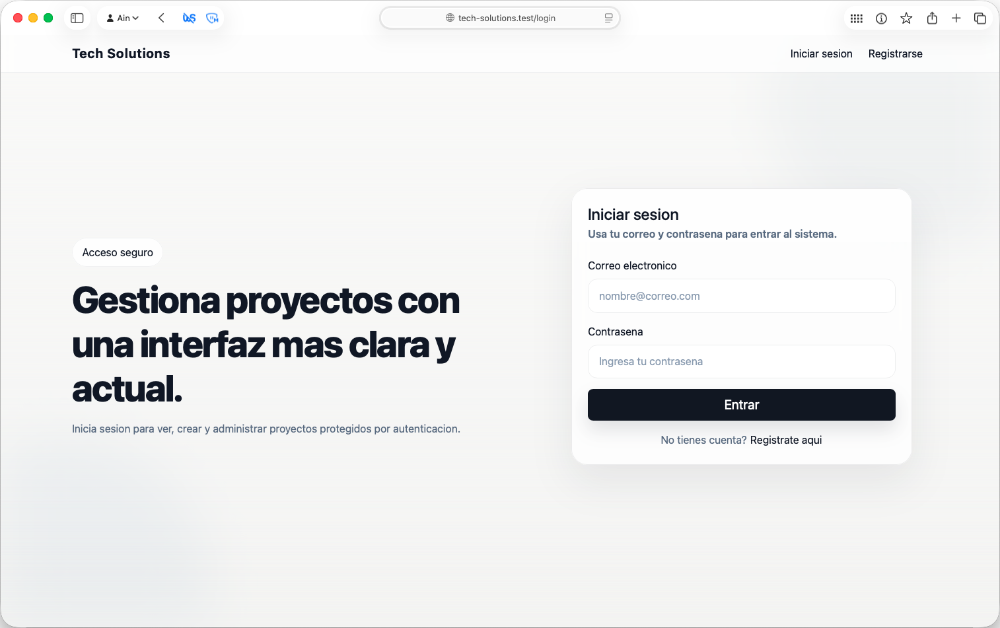

### Registro

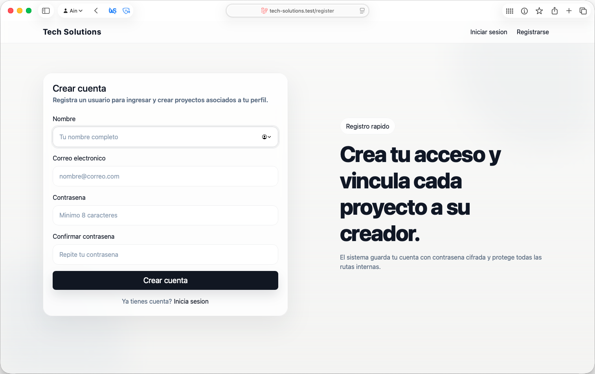

### Listado de proyectos

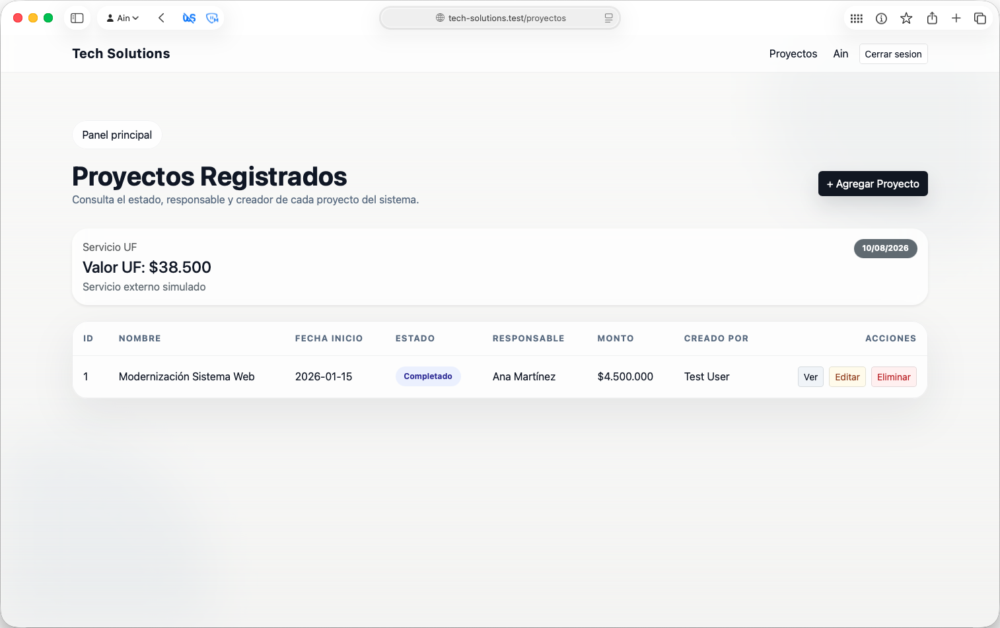

### Crear proyecto

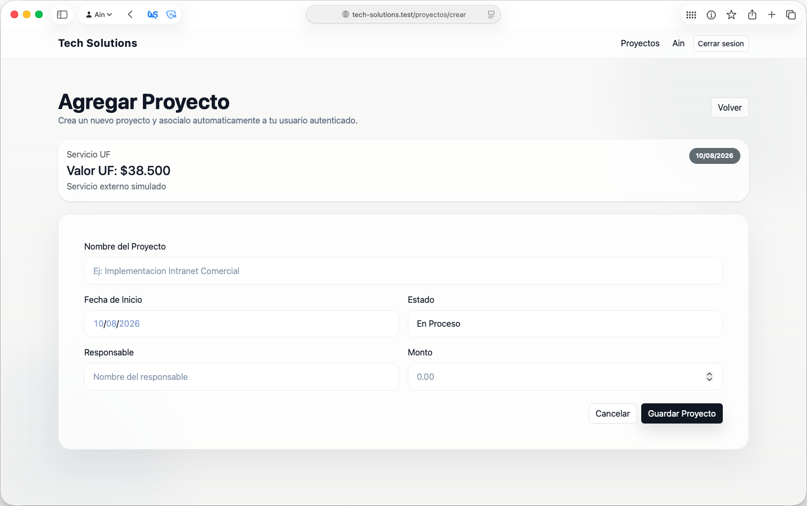

### Ver proyecto

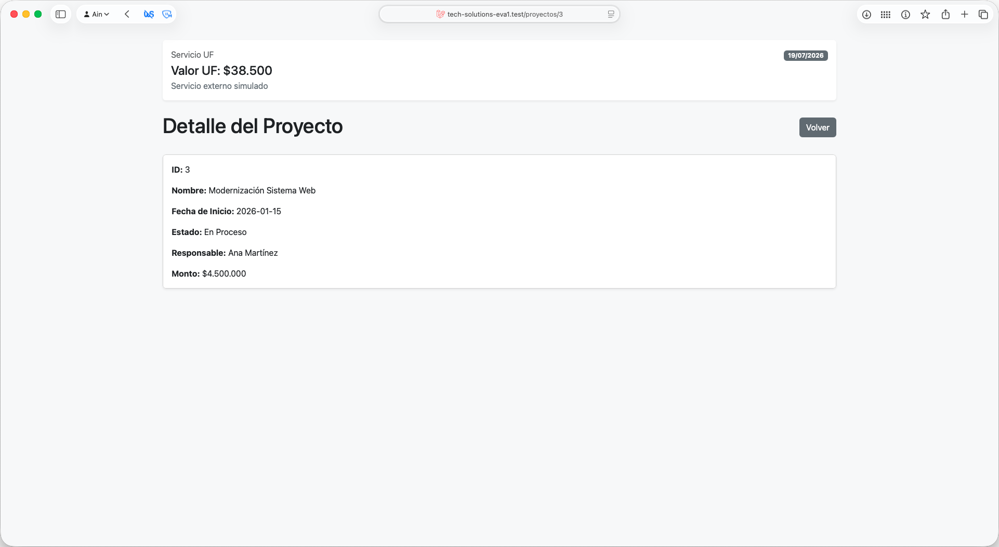

### Editar proyecto


### Eliminar proyecto

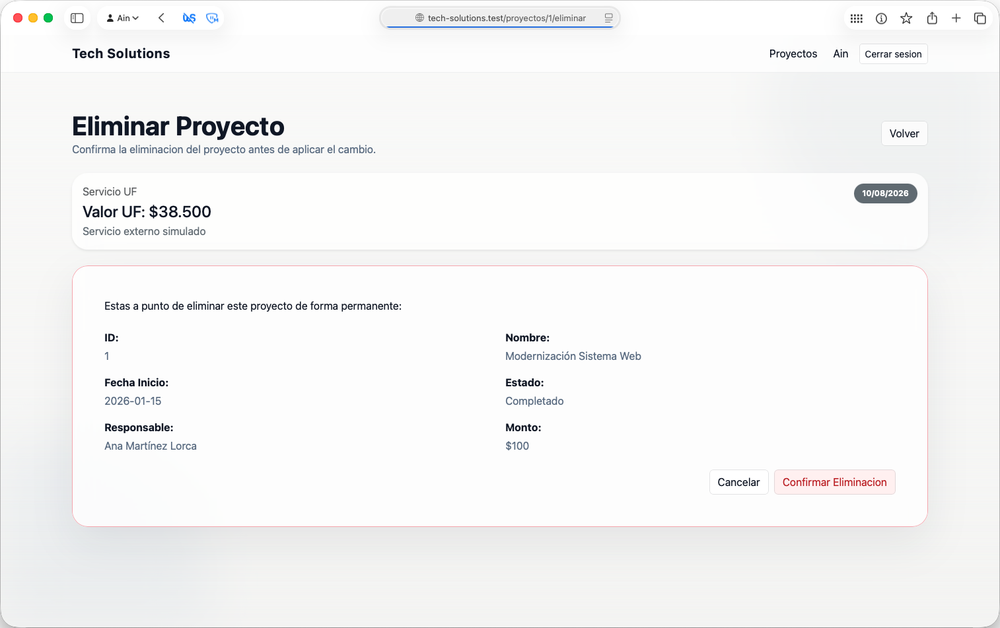

## Capturas de pruebas manuales

### Redireccion inicial a login

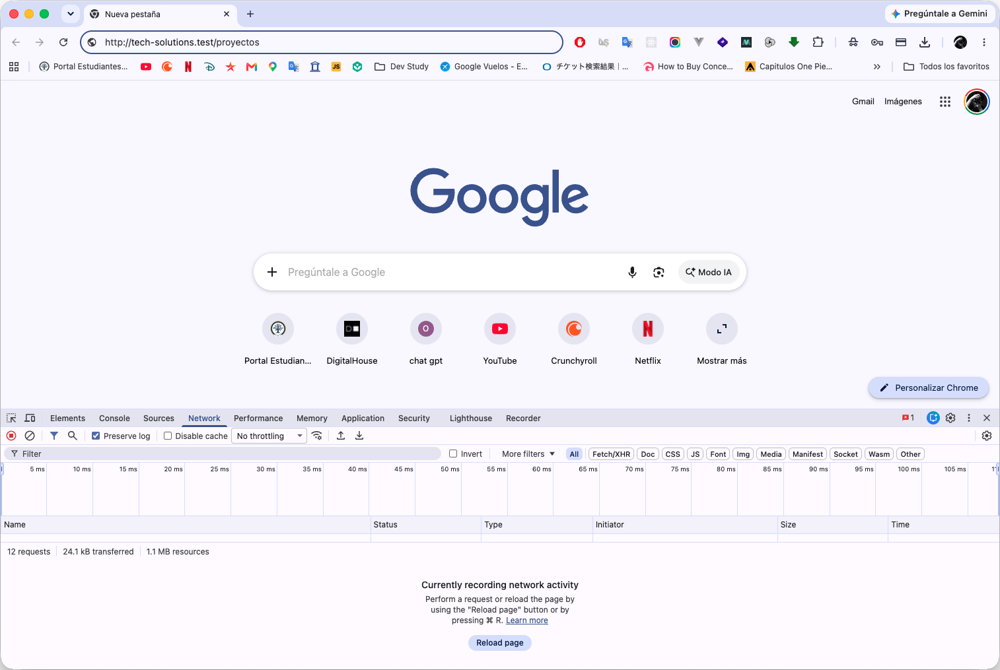

### Redireccion de ruta protegida sin sesion

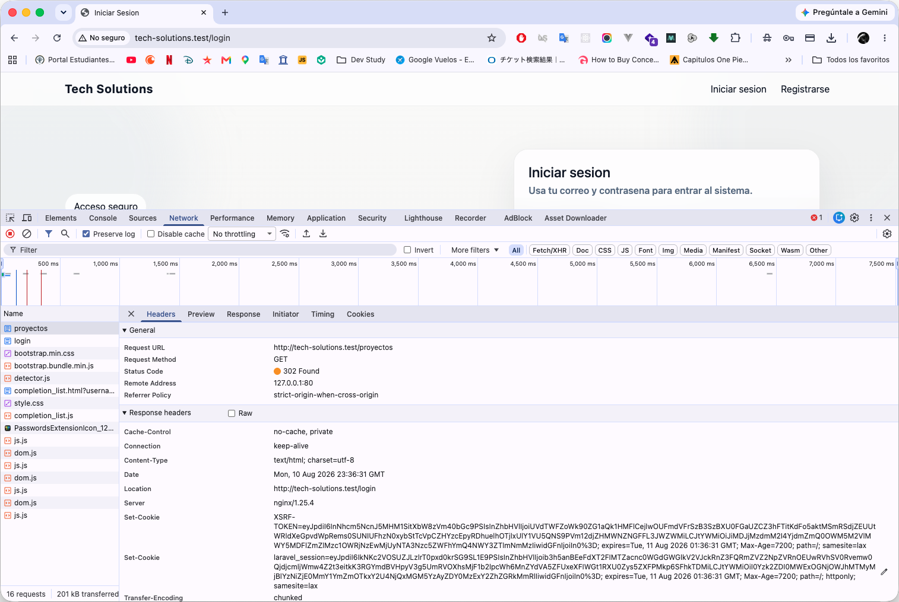

### Proyecto creado

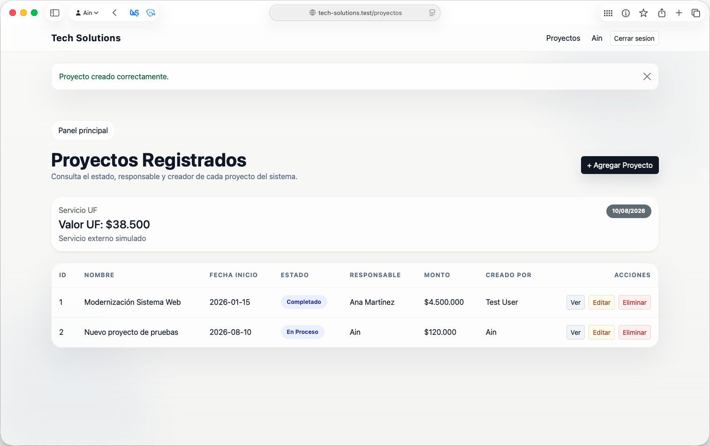

### Proyecto editado


### Proyecto eliminado

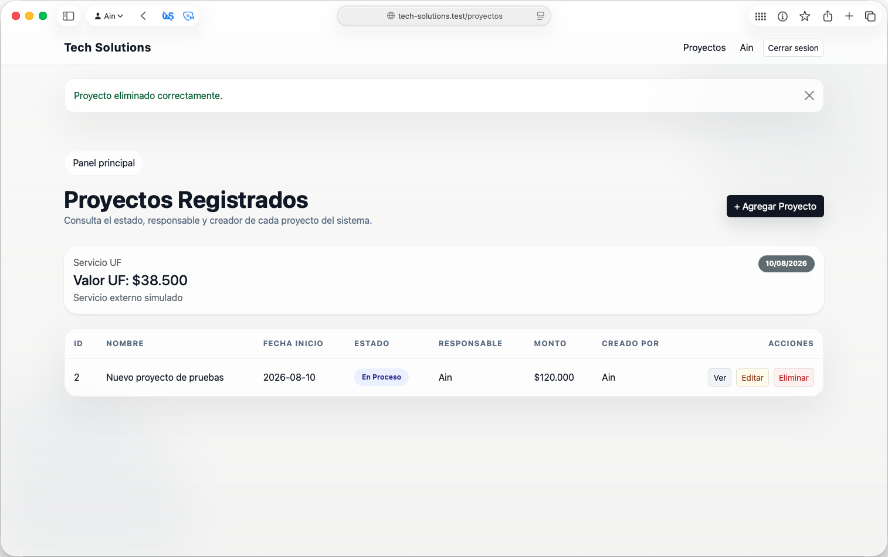

### Sesion cerrada

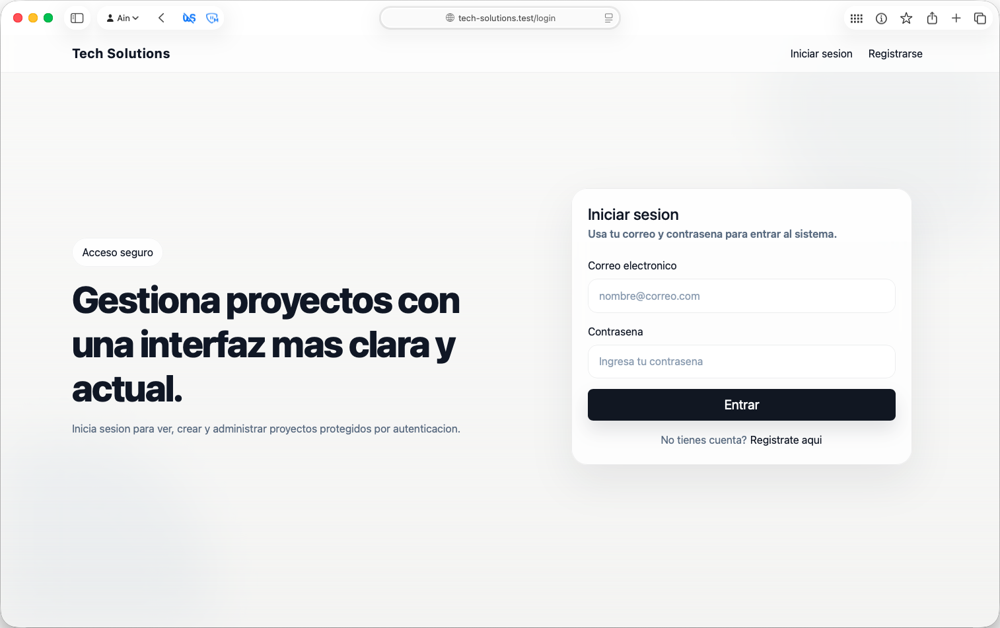
