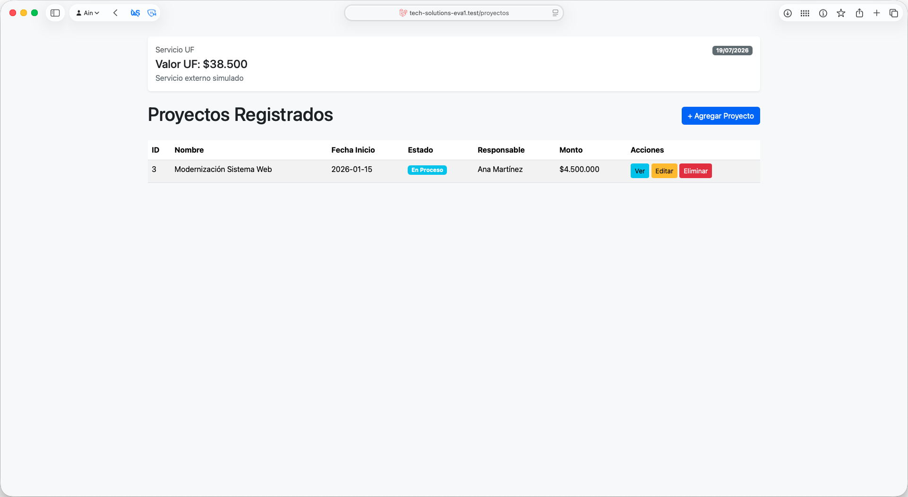
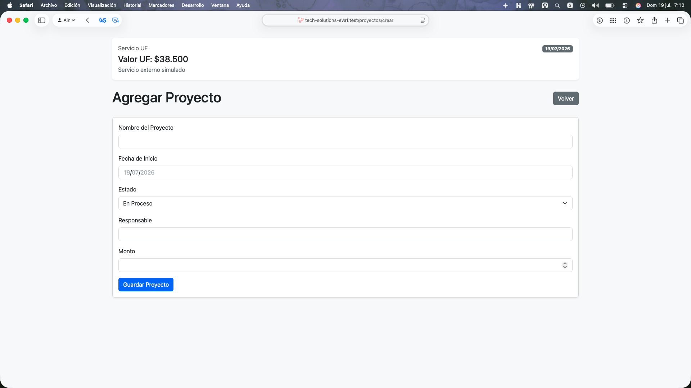
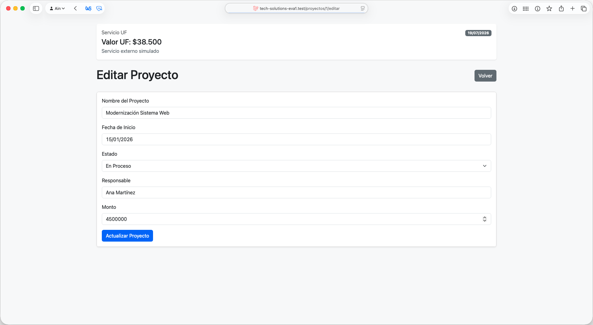
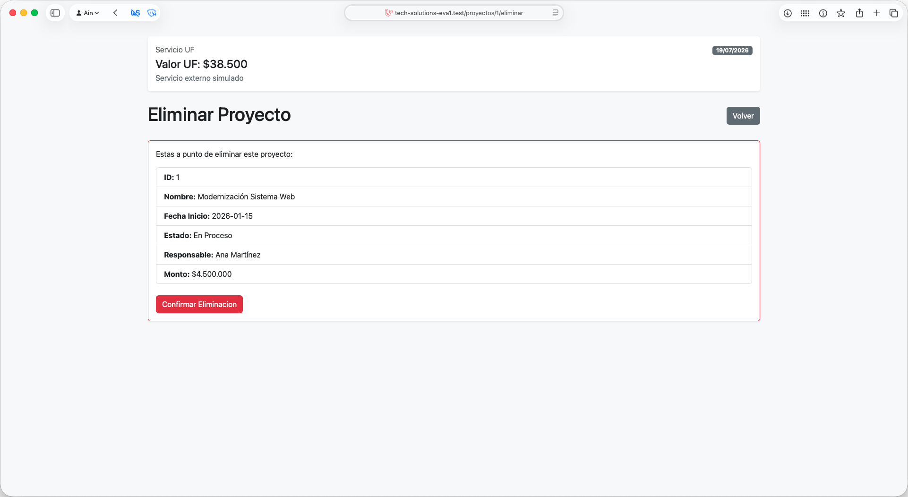

# Evaluación 1 Desarrollo de software web 1

## Encargo: Gestion de Proyectos

Aplicacion desarrollada en Laravel para la gestion basica de proyectos. Incluye listado, creacion, visualizacion, edicion y eliminacion de proyectos, siguiendo una estructura MVC simple con un unico controlador principal.

### Entrega:

- Integrantes
    - Pia Alarcón
    - Ain Cortés
- Sección: 50
- Docente: Victor Cofre

## Tecnologias utilizadas

- Laravel 11
- PHP 8.3
- Bootstrap 5
- SQLite

## Funcionalidades principales

- listado de proyectos
- vista para crear proyectos
- vista para ver un proyecto por ID
- vista para editar proyectos
- vista de confirmacion para eliminar proyectos
- componente reutilizable que muestra un valor UF simulado

## Modelo Proyecto

El modelo `Proyecto` considera los siguientes campos:

- `id`
- `nombre`
- `fecha_inicio`
- `estado`
- `responsable`
- `monto`

## Instalacion y ejecucion

1. Instalar dependencias de PHP:

```bash
composer install
```

2. Instalar dependencias de frontend:

```bash
npm install
```

3. Crear la base de datos y cargar datos de ejemplo:

```bash
php artisan migrate:fresh --seed
```

4. Levantar el servidor:

```bash
php artisan serve
```

5. En otra terminal, ejecutar Vite si se desea trabajar con assets en desarrollo:

```bash
npm run dev
```

## Rutas principales

- `/proyectos`
- `/proyectos/crear`
- `/proyectos/{id}`
- `/proyectos/{id}/editar`
- `/proyectos/{id}/eliminar`

## Base de datos

El proyecto utiliza SQLite como base de datos local y carga un proyecto de ejemplo mediante seeders.

## Componente UF

La vista principal de proyectos incorpora el componente reutilizable `x-uf-extract`, que muestra:

- nombre del servicio
- valor UF simulado
- fecha del dia
- mensaje de servicio externo simulado

## Capturas de pantalla Vistas solicitadas

### Listado de proyectos



### Crear proyecto



### Ver proyecto


### Editar proyecto



### Eliminar proyecto


